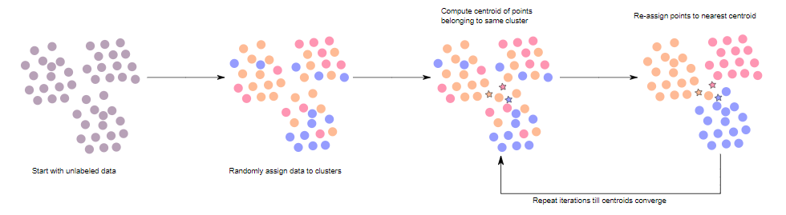
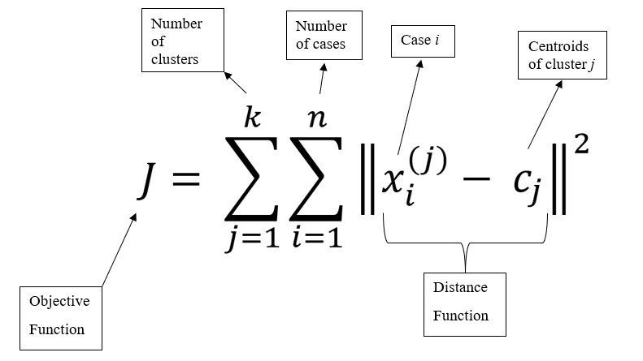
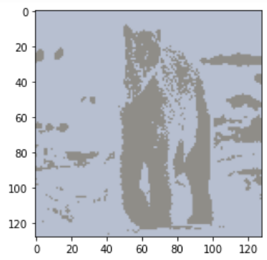
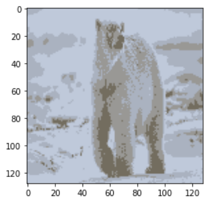
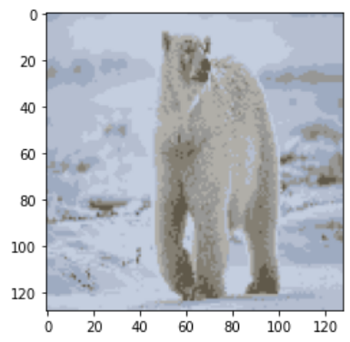

# K-Means-Means-from-Scratch
# 1. Introduction
K-means clustering is a type of unsupervised learning, which is used when you have unlabeled data. This is an algorithm that tries to minimize the distance of the points in a cluster with their centroid. Groups are known as cluster and the processs of creating the groups are known as clustering. Clustering is the process of dividing the entiire data into groups based on the pattern of the data.

# 2. Objective

* Group similar data points together and discover underlying patterns.
* K means algorithm identifies k number of centroids and allocates every data point to the nearest cluster.

# 3. K-Means Algorithm

The figure above shows the main points we need to take note when applying K-Means Algorithm
* These are the procedure for applying K-Means
*  1. Choose the number of cluster K.
*  2. Calculate the distance between each data point and each centroid
*  3. Assign all the points to the closest cluster centroid.
*  4. Calculate the distance between each data point and each centroid
*  5. Update the centroids to the calculated means of their respective clusters
*  6. Repeat steps 2 until 5 until reached stopping criteria of K-Means
      - Centroids of newly formed cluster do not change  
      - Points remain in the same cluster
      - Maximum number of iteration reached

# 4. Mathematical Formula

Formula for the distance calculation using square error function in step 2.

# 5. Image Segmentation

Image segmentation using K-Mean Clustering method

K = Number of clusters

Original Image

K = 2

K = 4

K = 7

As the number of clusters (K) increases the image contains less unwanted region or noise.

# 6. Reference
* https://www.researchgate.net/publication/283185016_Image_Segmentation_Using_K_-means_Clustering_Algorithm_and_Subtractive_Clustering_Algorithm
* https://www.kdnuggets.com/2019/08/introduction-image-segmentation-k-means-clustering.html
